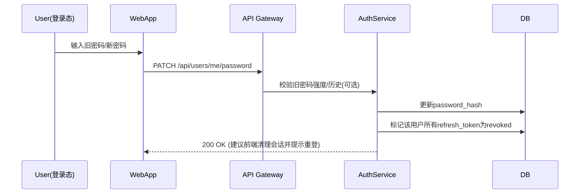
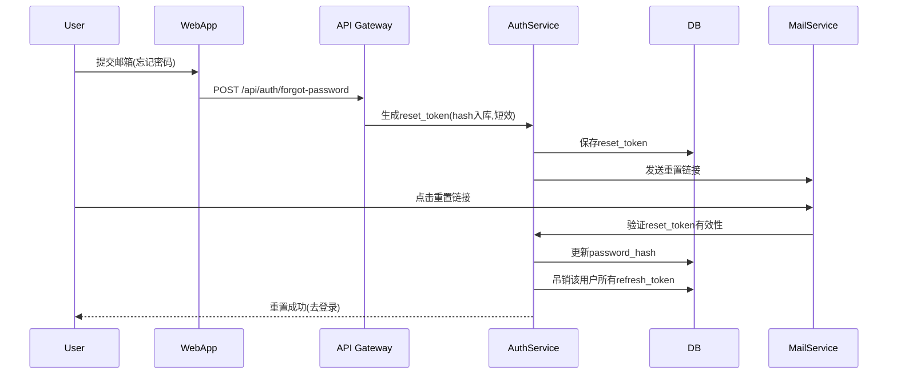

# 教育调度系统设计说明

> 注：我之所以选择该项目进行实践，是我本科毕业设计项目做的“选课系统的设计与实践”，两者在设计思想上有可复用的环节，下面先详细说明本系统的功能设计。
> 


# 一、 业务功能说明

> 该系统是给学校使用的平台。学生在平台选择老师和预约该老师的辅导，老师在平台设置自己的可预约时间段并对学生预约进行审批；系统根据不同的“服务级别”自动/人工批准，限制每月次数，并避免冲突。
> 

## 1.1 角色与权限

- **学生（student）**：查询老师及其可用时段、发起预约、查看/取消预约、接收通知。
- **教师（teacher）**：配置可用时段、设置阻塞时间、审批/拒绝预约、查看自己的日程。
- **管理员（admin）**：管理服务级别策略、配额、阈值、科目、全局运营报表、审计日志。

## 1.2 服务级别逻辑

- **Level1**：每月 2 次自动批准，额外需审批。
- **Level2**：所有会议均需审批。
- **Premium**：全部自动批准，且有优先权。
- **科目限制**：学生仅能预约教授其**已注册科目**的教师。
- **月度重置**：每月 1 日配额计数清零（以系统时区为准）

## 1.3 功能清单与说明

| 角色 | 功能 | 说明 | 关键规则 |
| --- | --- | --- | --- |
| 学生 | 搜索教师可用槽位 | 根据教师与日期返回可预约开始时间列表 | 遵守 availability、blocked、appointments、buffer，不超 maxDailyMeetings |
| 学生 | 创建预约 | 学生选择槽位创建预约 | 科目匹配、服务级别路由、槽位占用检查、幂等 |
| 学生 | 取消预约 | 在允许的时限内取消（例如会议开始前≥2h，可配置） | 已完成/已过期不可取消；写审计 |
| 学生 | 预约改期 | 取决于是否支持“移动”预约；默认实现为“取消+新建” | 改期需重过冲突与配额校验 |
| 学生 | 查看我的预约 | 按状态/时间范围分页查询 | 默认升序 |
| 教师 | 维护每周可用性 | 设置/更新 dayOfWeek + start/end | 同一天可多个区间 |
| 教师 | 维护阻塞时间 | 记录一段不可预约时间（上课/开会等） | 与预约冲突时提示风险 |
| 教师 | 审批/拒绝预约 | 对所有pending 执行 approve/cancel | 记录原因、时间；通知 |
| 管理 | 服务级别策略 | 配额阈值、超时阈值、提醒策略等参数化 | 可后续抽象为策略表 |
| 系统 | 48h 待审批过期 | 定时扫描 pending 超时→expired | 发送过期通知 |
| 系统 | 月初配额重置 | 每月1日重置 Level1/2 配额计数 | 更新时间戳 |
| 系统 | 提醒通知 | T-24h / T-1h 提醒学生&教师 | 队列/定时触发 |
| 系统 | 候补队列 | 若热门时段被占，可加入候补；释放时自动顶替 | 顶替后通知双方 |

# 二、系统整体设计与架构

## 2.1 整体架构


**说明：**

- **Auth Service**：负责用户注册、登录、JWT 校验、邀请码注册。
- **Scheduler Service**：负责预约逻辑（可用槽位计算、冲突校验、配额追踪、审批工作流）。
- **Teacher Service**：教师可用性、阻塞时间、审批。
- **Admin Service**：策略管理、用户管理、审计查询。
- **Notification Service**：提醒通知、过期通知。
- **Database**：PostgreSQL，包含认证表、业务表、审计表。
- **Cache**：Redis，缓存热门槽位和查询结果。
- **Message Queue**：Kafka/RabbitMQ，处理通知、批量任务。

# 三、模块设计

## **3.1 用户注册与登录模块**

### 3.1.1 学生注册/登录

**注册步骤**

- 自助注册：仅允许创建 `role=student`。
- 表单：email、password、（可选）姓名、年级、`enrolledSubjects` 初始化。
- 校验：邮箱唯一+密码强度；写入 `users(status=pending)` 与 `students` 扩展表；发验证邮件。
- 激活：点击邮件魔法链接 → `users.status=active`。

**登录步骤**

- 输入 email/password → 校验 `users.status in ('active')` → 返回 `accessToken(15min)` 与 `refreshToken(30d)`
- 记录 `last_login_at`，写审计日志（action=login）。

### 3.1.2 教师注册/登录

**注册步骤**

- 推荐“受邀注册”：管理员或超级管理员预创建“教师邀请”（见 3.1.3），教师通过邀请邮件完成注册与激活。
- 也可开放“自助注册”但需添加“人工审核通过后生效”的开关（机构可配置），以防伪冒教师。

**登录步骤**

- 同学生；激活后可登录，完善 `subjects/maxDailyMeetings/bufferMinutes` 等。


### 3.1.3 管理员登录（含超级管理员引导）

**初始化超级管理员（一次性）**

- 首次部署时，通过“引导口令（env）+受控入口”完成超级管理员（`role=admin,is_super=true`）创建。
- 创建成功后**自动失效**引导口令，避免重放。

**管理员创建与权限**

- 管理员账号仅能由**超级管理员**创建（或发出“管理员邀请”）；普通管理员不可自助注册。
- 管理员拥有后台管理入口，可管理策略/用户与审计，但不能越权提权。
- 普通管理员：可登录与修改自己密码；**不能**创建新管理员。


### 3.1.4 修改密码

- 场景：登录用户在“个人设置”中修改自己的密码。
- 流程：输入旧密码 → 校验 → 以 Argon2id/bcrypt(≥10) 重新哈希新密码 → 失效该用户所有 `refreshToken`（强制其它设备退出）→ 审计(action=password_change)。`users.password_hash` 字段已存在。



### 3.1.5 忘记密码

- “忘记密码”入口输入邮箱 → 如果用户存在且可恢复，生成一次性 `reset_token`（15–30 分钟有效），发送邮件。
- 用户通过邮件链接进入“重置密码”页 → 设置新密码 → 失效所有会话/刷新令牌 → 审计(action=password_reset)。



### 3.1.6 登录/刷新/登出


### 3.1.7 安全与风控

- 密码策略：长度≥8，至少 1 位字母+数字（机构可配置）。
- 登录限流：按 IP 与邮箱做滑动窗口限速（Redis key），登录失败 N 次后临时锁定账户。
- 邮件链接：单次使用、最少权限、短期有效；所有令牌只保存哈希。
- 审计：`audit_logs(actor_id, action, target_id, created_at)` 已有表对接登录/修改密码/重置密码等事件。
- 账号状态：`users.status in ('pending','active','frozen')`，被冻结用户阻断发起预约/审批等写操作。

## 3.2 学生｜搜索教师可用槽位

**目标**：根据教师与日期返回可预约开始时间列表。

**关键规则**：遵守 `availability`、`blocked_times`、`appointments`、`buffer`，不超 `maxDailyMeetings`。

**步骤**：

1. 前端收集 `teacherId/date/duration` 调用 API。
2. 服务器先查缓存；未命中则：
    - 读教师当日 `availability`；
    - 读当日 `appointments(status in [pending,approved])`；
    - 读 `blocked_times`；
    - 读取 `bufferMinutes/maxDailyMeetings`；
    - 逐槽位切片并做**区间重叠 + 缓冲**检测；
    - 可按 `maxDailyMeetings` 截断；
    - 写入短期缓存返回。
3. 响应 `slots[]`（UTC），前端按用户时区渲染。


## 3.3 学生｜创建预约

**目标**：学生选择槽位创建预约。

**关键规则**：科目匹配、服务级别路由、槽位占用检查、幂等。

**步骤**：

1. 校验主体：学生/教师存在、`subject` 同时包含于 `student.enrolledSubjects` 与 `teacher.subjects`。
2. **槽位可用性**：可直接重跑 `generateAvailableSlots()` 并校验 `scheduledTime` 在返回集内（规避并发）。
3. **服务级别路由**：
    - Level1：若 `monthlyMeetingsUsed < 2` → `approved`，并在事务内 +1；否则 `pending`；
    - Level2：`pending`；
    - Premium：`approved`（可选：抢占低优先级 `pending`）。
4. **幂等**：使用 `idempotencyKey` 唯一键；重复提交返回已创建记录。
5. **缓存失效**：删除相关 `slots:{tid}:{date}:{duration}`。
6. **通知**：根据结果发送邮件（已批核/等待审批）。


## 3.4 学生｜取消预约

**目标**：允许在会议开始前≥2h（可配置）取消。

**关键规则**：`completed/expired` 不可取消；写审计。

**步骤**：

1. 校验请求者为该预约的学生；
2. 校验 `now <= scheduledTime - cancelWindow(2h)`；
3. 状态允许：`pending|approved`；
4. 更新为 `cancelled`，写审计与可选的取消原因；
5. 失效槽位缓存；通知相关教师。


## 3.5 学生｜预约改期

**目标**：默认以“取消+新建”实现。

**关键规则**：新建需重新通过**冲突与配额**校验。

**步骤**：

1. 先按 **取消**规则处理旧预约；
2. 使用新槽位按 **创建**流程重建；
3. （可选）提供单事务“移动预约”接口，需要更复杂的区间锁与冲突处理。


## 3.6 学生｜查看我的预约

**目标**：按状态/时间范围分页查询，默认按时间升序。

**步骤**：

1. 校验身份；
2. 组合 where 条件与时间范围；
3. 游标分页返回列表与下一页游标。


## 3.7 教师｜维护每周可用性

**目标**：设置/更新 `dayOfWeek + start/end`，同一天可多个区间。

**步骤**：

1. 校验教师身份与字段合法性；
2. 新增或覆盖区间（避免交叉重叠的可选校验）；
3. 失效未来若干天的 `slots` 缓存键（或标记为脏）。


## 3.8 教师｜维护阻塞时间

**目标**：记录一段不可预约时间（上课/开会/休假等）。

**关键规则**：与预约冲突时提示风险（需人工沟通）。

**步骤**：

1. 校验时间范围与最小粒度；
2. 写入 `blocked_times`；
3. 若与既有预约重叠，返回告警字段供前端提示；
4. 失效相关日期的槽位缓存。


## 3.9 教师｜审批/拒绝预约

**目标**：对 `pending` 执行 `approve|cancel`。

**关键规则**：记录原因/时间；通知。

**步骤**：

1. 校验操作者为该教师；
2. 若状态非 `pending` → `STATE_CONFLICT`；
3. 按动作更新状态并记录审计；
4. 发送结果通知。


## 3.10 管理｜服务级别策略

**目标**：参数化配额阈值、超时阈值、提醒策略等（为后续策略表做准备）。

**步骤**：

1. 定义策略表（可含租户维度）；
2. 业务读取策略时加入缓存；
3. 更新策略时广播/刷新相关缓存键。


## 3.11 系统｜48h 待审批过期

**目标**：定时扫描 `pending` 超时→`expired` 并通知。

**步骤**：

1. Cron 定时触发；
2. 分页批处理，避免大事务；
3. 记录审计与失败重试统计；
4. 可选：将通知推入队列异步发送。


## 3.12 系统｜月初配额重置

**目标**：每月 1 日重置 Level1/2 配额计数并更新时间戳。

**步骤**：

1. 约定触发时间（系统时区/教师时区，择一并在 UI 明示）；
2. 支持幂等多次执行；
3. 记录执行日志与指标。


## 3.13 系统｜提醒通知

**目标**：T-24h / T-1h 提醒学生与教师。

**步骤**：

1. 计算时间窗口（UTC）；
2. 防重：对同一预约同一提醒类型设置指纹去重；
3. 失败重试与退避


## 3.14 系统｜候补队列

**目标**：热门时段被占时可加入候补，释放时自动顶替。

**步骤**：

1. 候补表结构：`teacherId,date,slot,studentId,priority,status,createdAt`；
2. 槽位释放触发器：取消/拒绝/过期事件监听；
3. 选取规则：按优先级+时间先后；
4. 创建预约与通知（可设置“保留时长”，逾期自动回收给下一位）。


# 四、数据库设计

## 4.1 users（统一身份表）

| 字段名 | 类型 | 约束 | 说明 |
| --- | --- | --- | --- |
| id | UUID | PK | 统一用户 ID |
| email | VARCHAR(255) | UNIQUE, NOT NULL | 登录邮箱 |
| password_hash | VARCHAR(255) | NOT NULL | 密码哈希（Argon2id / bcrypt≥10） |
| role | ENUM('student','teacher','admin') | NOT NULL | 默认角色（登录后授权用） |
| status | ENUM('pending','active','frozen') | NOT NULL DEFAULT 'pending' | 账户状态 |
| last_login_at | TIMESTAMPTZ |  | 最近登录时间 |
| created_at | TIMESTAMPTZ | DEFAULT NOW() |  |
| updated_at | TIMESTAMPTZ | DEFAULT NOW() |  |
|  |  |  |  |

## 4.2 students（学生扩展表）

| 字段名 | 类型 | 约束 | 说明 |
| --- | --- | --- | --- |
| id | UUID | PK |  |
| user_id | UUID | FK → users(id), UNIQUE, NOT NULL | 与 users 1:1 绑定 |
| service_level | ENUM('level1','level2','premium') | NOT NULL | 服务级别 |
| monthly_meetings_used | INT | DEFAULT 0 | 当月已用配额 |
| last_quota_reset | DATE | DEFAULT CURRENT_DATE | 上次配额重置日期 |
| enrolled_subjects | TEXT[] |  | 已选科目 |
| grade_level | INT |  | 年级 |
| created_at | TIMESTAMPTZ | DEFAULT NOW() |  |

## 4.3 teachers（教师表）

| 字段名 | 类型 | 约束 | 说明 |
| --- | --- | --- | --- |
| id | UUID | PK |  |
| user_id | UUID | FK → users(id), UNIQUE, NOT NULL | 与 users 1:1 绑定 |
| subjects | TEXT[] |  | 授课科目（未来可拆为字典表+关联表） |
| max_daily_meetings | INT | DEFAULT 6 | 每日上限 |
| buffer_minutes | INT | DEFAULT 15 | 会议缓冲分钟 |
| timezone | VARCHAR(64) | NOT NULL DEFAULT 'Asia/Shanghai' | 教师所在时区 |
| created_at | TIMESTAMPTZ | DEFAULT NOW() |  |

## 4.4 admins（管理员表）

| 字段名 | 类型 | 约束 | 说明 |
| --- | --- | --- | --- |
| id | UUID | PK |  |
| user_id | UUID | FK → users(id), UNIQUE, NOT NULL | 与 users 1:1 绑定 |
| scope | JSONB |  | 管理范围（学院/院系/年级） |
| created_at | TIMESTAMPTZ | DEFAULT NOW() |  |

## 4.5 teacher_availability（教师可用性）

| 字段名 | 类型 | 约束 | 说明 |
| --- | --- | --- | --- |
| id | UUID | PK |  |
| teacher_id | UUID | FK → teachers(id), NOT NULL | 教师 |
| day_of_week | INT | 0–6 | 周日=0 |
| start_time | TIME | NOT NULL |  |
| end_time | TIME | NOT NULL |  |
| is_recurring | BOOLEAN | DEFAULT true | 是否每周重复 |

## 4.6 blocked_times（阻塞时段）

| 字段名 | 类型 | 约束 | 说明 |
| --- | --- | --- | --- |
| id | UUID | PK |  |
| teacher_id | UUID | FK → teachers(id) | 教师 |
| start_time | TIMESTAMPTZ | NOT NULL |  |
| end_time | TIMESTAMPTZ | NOT NULL |  |
| reason | VARCHAR(255) |  | 原因 |
| created_at | TIMESTAMPTZ | DEFAULT NOW() |  |

## 4.7 appointments（预约表）

| 字段名 | 类型 | 约束 | 说明 |
| --- | --- | --- | --- |
| id | UUID | PK |  |
| student_id | UUID | FK → students(id) | 学生 |
| teacher_id | UUID | FK → teachers(id) | 教师 |
| subject | VARCHAR(100) | NOT NULL | 科目 |
| scheduled_time | TIMESTAMPTZ | NOT NULL | 开始时间（UTC） |
| duration_minutes | INT | DEFAULT 30 | 时长（分钟） |
| status | ENUM('pending','approved','completed','cancelled','no_show','expired') | NOT NULL | 统一状态枚举 |
| approval_required | BOOLEAN | NOT NULL | 是否需审批 |
| approved_at | TIMESTAMPTZ |  | 审批时间 |
| idempotency_key | VARCHAR(128) | UNIQUE | 幂等键 |
| created_at | TIMESTAMPTZ | DEFAULT NOW() |  |
| time_range | TSTZRANGE | 生成列：`tstzrange(scheduled_time, scheduled_time + duration_minutes * interval '1 minute')` |  |
| 约束 | EXCLUDE USING GIST (teacher_id WITH =, time_range WITH &&) | 防止时间重叠 |  |

## 4.8  服务级别策略表（service_policies）

| 字段名 | 类型 | 描述 |
| --- | --- | --- |
| policy_id | UUID | 策略 ID |
| level | Enum | 服务级别 |
| max_daily | Int | 每日最大预约数（当 `teacher.max_daily_meetings` 存在时**优先生效**） |
| expire_hours | Int | 待审批过期时长（小时） |
| reminder | Boolean | 是否开启提醒 |

## 4.9 审计日志表（audit_logs）

| 字段名 | 类型 | 描述 |
| --- | --- | --- |
| log_id | UUID | 日志 ID |
| actor_id | UUID | 操作者 ID |
| action | String | 动作名称 |
| target_id | UUID | 目标对象 ID |
| created_at | DateTime | 操作时间 |

# 五、接口设计

## 5.1  学生端接口（Student APIs）

> 鉴权：Bearer JWT（role=student）。时区：所有时间字段均为 ISO8601 UTC。
> 

### 5.1.1 查询教师可用槽位

- **GET** `/api/slots?teacherId={id}&date=YYYY-MM-DD&duration=30`
- **说明**：`date` 参数**按教师时区**解释，后端换算为 UTC 存储与计算。
- **请求参数**：
    - `teacherId` *(required)*：教师 ID
    - `date` *(required)*：日期
    - `duration` *(optional, default=30)*：会议时长（分钟）
- **响应 200**：

```json
{
  "teacherId": "t_123",
  "date": "2025-08-22",
  "duration": 30,
  "slots": ["2025-08-22T01:00:00Z", "2025-08-22T01:30:00Z"]
}
```

- **错误**：`BAD_REQUEST`、`TEACHER_NOT_FOUND`。

### 5.1.2 创建预约

- **POST** `/api/appointments`
- **说明**：根据服务级别自动路由到 `approved`/`pending`，带幂等键。
- **请求体**：

```json
{
  "studentId": "s_123",
  "teacherId": "t_123",
  "subject": "math",
  "scheduledTime": "2025-08-22T01:00:00Z",
  "durationMinutes": 30,
  "idempotencyKey": "s_123-t_123-2025-08-22T01:00:00Z"
}
```

- **响应 201**：

```json
{ 
"id": "a_456", 
"status": "approved", 
"approvalRequired": false 
}
```

- **错误**：`SUBJECT_MISMATCH`、`SLOT_TAKEN`、`QUOTA_EXCEEDED`、`MAX_DAILY_REACHED`、`IDEMPOTENT_CONFLICT`、`BAD_REQUEST`。

### 5.1.3 取消预约

- **PATCH** `/api/appointments/{id}`
- **请求体**：`{ "action": "cancel", "reason": "计划冲突" }`
- **响应 200**：`{ "ok": true }`
- **错误**：`STATE_CONFLICT`（如已 completed/expired）、`FORBIDDEN`（越权）。

### 5.1.4 我的预约列表

- **GET** `/api/appointments?role=student&studentId={id}&status={pending|approved|...}&from=&to=&cursor=&limit=`
- **响应 200**：

```json
{ 
"items": 
[
	{
		"id":"a_1",
		"scheduledTime":"...",
		"status":"approved"
		}
	], 
"nextCursor": "eyJpZCI6..." 
}
```

### 5.1.5 改期（默认：取消+新建）

- 先调用 **5.1.3** 取消，再调用 **5.1.2** 创建新预约；
- （可选）将来提供 `/api/appointments/{id}/reschedule` 一步到位接口。

---

## 5.2 教师端接口（Teacher APIs）

> 鉴权：Bearer JWT（role=teacher）。仅能操作自己的资源。
> 

### 5.2.1 维护每周可用性

- **GET** `/api/teachers/{id}/availability`
- **POST** `/api/teachers/{id}/availability`
- **POST 请求体**：

```json
{ 
"dayOfWeek": 1,
 "startTime": "09:00", 
 "endTime": "12:00", 
 "isRecurring": true 
 }
```

- **响应 200**：`{ "ok": true }`

### 5.2.2 维护阻塞时间

- **POST** `/api/blocked-times`
- **请求体**：

```json
{
 "teacherId": "t_123", 
 "startTime": "2025-08-22T02:00:00Z", 
 "endTime": "2025-08-22T04:00:00Z", 
 "reason": "Dept meeting" 
 }
```

- **响应 200**：`{ "ok": true }`

### 5.2.3 审批/拒绝预约

- **PATCH** `/api/appointments/{id}`
- **请求体**：`{ "action": "approve" }` 或 `{ "action": "cancel", "reason": "不合适" }`
- **响应 200**：`{ "ok": true }`
- **错误**：`STATE_CONFLICT`（当前不是 pending）。

### 5.2.4 教师视角预约列表

- **GET** `/api/appointments?role=teacher&teacherId={id}&status=&from=&to=&cursor=&limit=`

---

## 5.3 系统与管理接口（System & Admin APIs）

> 鉴权：Bearer JWT（role=admin 或后台任务令牌）。
> 

### 5.3.1 服务级别策略（可选）

- **PUT** `/api/policies`
- **请求体**：

```json
{
    "level1": {
        "monthlyAutoApprove": 2
    },
    "level2": {
        "monthlyAutoApprove": 0
    },
    "premium": {
        "priority": true
    },
    "expireHours": 48,
    "remindOffsets": [
        24,
        1
    ]
}
```

- **响应 200**：`{ "ok": true }`

### 5.3.2 48 小时待审批过期 Job

- **POST** `/api/jobs/expire-pending`
- **响应 200**：`{ "updated": 12 }`

### 5.3.3 月初配额重置 Job

- **POST** `/api/jobs/reset-quota`
- **响应 200**：`{ "updated": 245 }`

### 5.3.4 健康检查

- **GET** `/api/healthz` → `200`

```json
{
    "ok": true,
    "time": "..."
}
```

### 5.3.5 候补队列

- **POST** `/api/waitlist`
    
    请求体：
    
    ```json
    {
        "teacherId": "t_1",
        "date": "2025-08-22",
        "slot": "2025-08-22T01:00:00Z",
        "studentId": "s_1"
    }
    ```
    
- **POST** `/api/waitlist/promote` （系统内部，当槽位释放时触发）

# 六、系统安全

- **认证与会话**
    - Access Token (JWT, 15m) + Refresh Token (30d, 可轮换)，存放 HttpOnly+Secure Cookie。
    - 修改密码/重置密码时吊销全部 Refresh。
- **密码策略**
    - 最少 8 位，含字母与数字。
- **防暴力与限流**
    - 登录与重置接口：Redis 滑动窗口限速，失败 N 次锁定账户。
- **邮件安全**
    - 所有邮件 Token 仅保存哈希，单次使用，短期有效。
- **审计与RBAC**
    - 所有敏感操作写 `audit_logs`。
    - 严格基于 `role + scope` 做 API 权限校验。